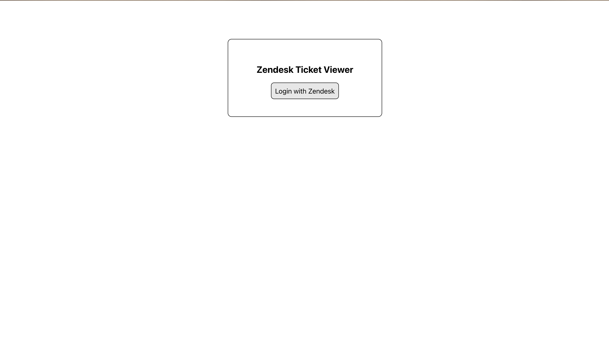
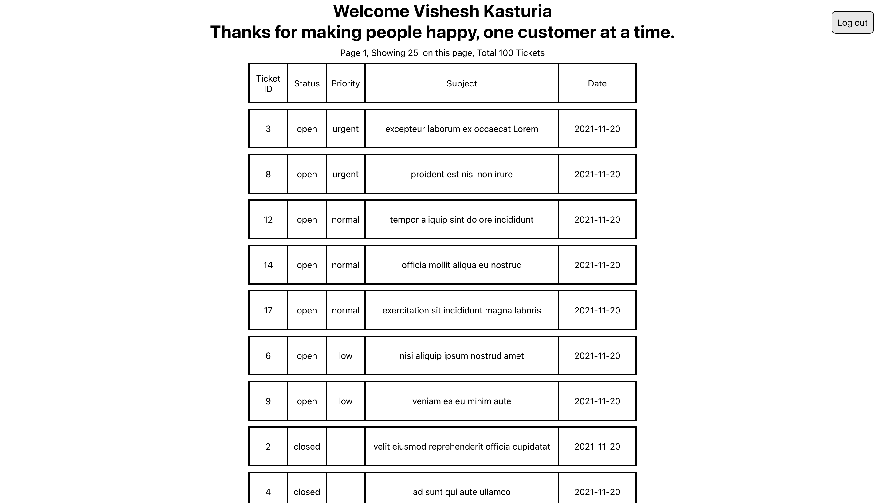
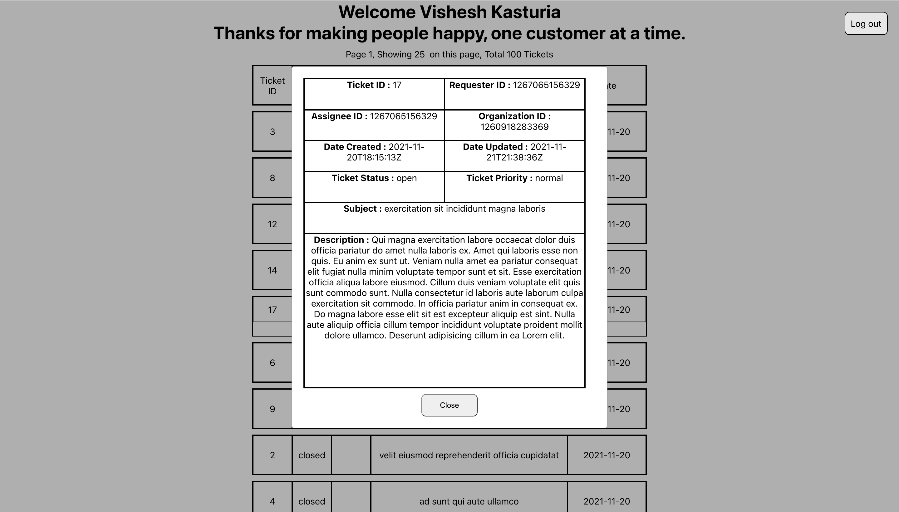
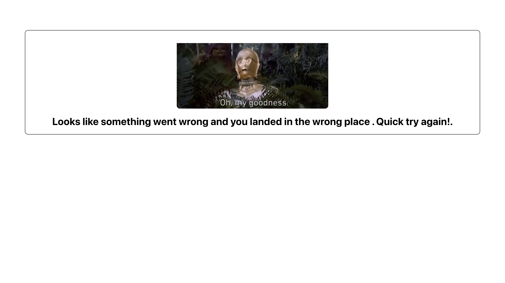

# Zendesk Coding Challenge - Zendesk Ticket Viewer - Vishesh Kasturia

## Introduction

Zendesk Ticket Viewer is a simple web app to view all the tickets in your account.

The frontend for the web app has been created using React while the backend utilises Node.js and Express.js.

## Table of Contents

- [Setup](#Setup)
- [Technologies](#Technologies)
- [App Functioning](#AppFunctioning)
- [Screenshots](#Screenshots)

## Setup

To run this project, please follow the following steps:

**1. Configuring OAuth Zendesk Domain**

1. Follow steps at Zendesk for [Registering your application with Zendesk](https://support.zendesk.com/hc/en-us/articles/4408845965210-Using-OAuth-authentication-with-your-application)

2. Make note of the following:

- Domain url
- Redirect uri
- Client id
- Client secret

**2. Edit the .env file in zccvisheshkasturia-ticket-view-backend**

```
DOMAIN_URL = # <example: https://example.zendesk.com> - Note: No trailing '/'
SERVER_PORT = 5000 # (Do not change since requests in local are being proxied in package.json)
REDIRECT_URI = # <example: http://localhost:5000/handleUserDecision>
CLIENT_ID = # <example: client-id-zendesk>
CLIENT_SECRET = # <your client secret>
```

**3. Starting the backend**

```
$ cd zccvisheshkasturia-ticket-viewer-backend
$ npm install
$ npm start
```

**4. Starting the frontend**

```
$ cd zccvisheshkasturia-ticket-viewer
$ npm install
$ npm start
```

Thats it you're done!

**5. Linting and Testing(OPTIONAL)**

```
$ cd zccvisheshkasturia-ticket-viewer
$ npm run lint
$ npm test -- --coverage
```

## Technologies

The project primarily utilises React.js, Node.js and Express.js for some particular reasons:

- It facilitates the MVC architecture which makes web development process **scalable** and the front-end and back-end remain **decoupled**
- The framework provides lot of libraries which make development easy.
- Robust and support for testing libraries.
- Most libraries are installed locally and have low global dependencies
- One of the most popular frameworks for making web apps.
- Great documentation and support

**1. Front-end (React.js)**

- axios version 0.24.0 -- Making http requests
- eslint version 7.32.0 -- Code style (Airbnb)
- js-cookie version 3.0.1 -- Reading Cookie from react
- react version 17.0.2
- react-dom version 17.0.2
- "react-router version 6.0.2 -- Router for handling navigation
- "react-router-dom" version 6.0.2
- "react-scripts version 4.0.3
- "web-vitals version 1.1.2
- "@testing-library/user-event version 12.8.3 -- Unit Testing
- "@testing-library/jest-dom version ^5.15.1 -- Unit Testing

**2. Back-end (Node. js and Express.js)**

- axios version 0.24.0 --Making http requests
- body-parser version 1.19.0 --Middleware for parsing request bodies
- cookie-parser version 1.4.6 --Middleware for handlig cookies
- cors version 2.8.5 --Allowing cross origin access
- dotenv version 10.0.0 -- Using .env file
- express version 4.17.1 -- Provides common utilities such as URL routing for building and creating servers & web applications
- nodemon version 2.0.15 -- ease in development restarts server upon save changes

## AppFunctioning

**1.Login** uses OAuth authorization over Username/ Password or Username/ Token for some particular reasons:

- Backend never stores sensitive information such as password or token
- Enables limited access scopes
- More robust and secure way of accessing Zendesk data
- Zendesk API handles invalid data

In the backend, User's authorization code is swapped for access token.
The token is then used to get user information using Zendesk User/me API and the data is written to a **cookie**.

**2. Getting Tickets:** After logging in, the app reads cookie set by the backend to display username and calls a proxy backend served by Node.js and Express.js which fetch user Tickets from Zendesk Requests API and returns the result to React.

**3. Logout:** When the user clicks logout they are redirected to home page and their cookie data is cleared from backend.

**4. Error:** If anything goes wrong in the process the app redirects to /NotFound and displays a static error message.

## Screenshots

1. Login Screen
   

2. List of Tickets
   

3. Ticket Details
   

4. Not Found Screen
   
